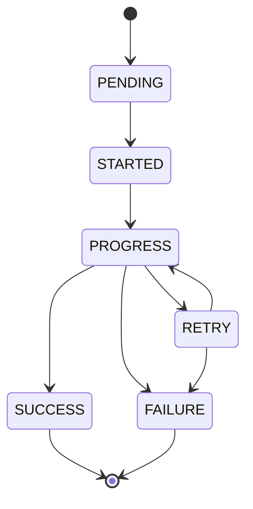
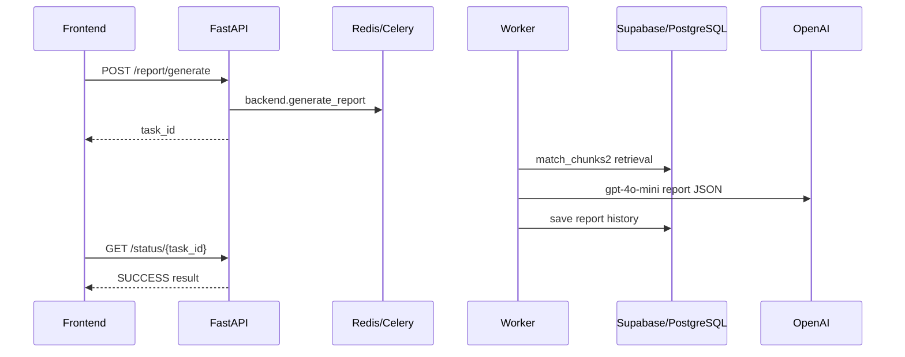

# API Reference Extended

Status: internal technical documentation  
Project: `JKPSZ3-platforma-etg`  
Last updated: 2026-05-24  
Primary audience: frontend developers, backend developers, QA, integrators

## 1. Overview

The backend is a FastAPI application exposed from `backend/main.py`. Most
business endpoints require a JWT bearer token:

```http
Authorization: Bearer <token>
```

Long-running operations return a Celery `task_id`. Clients must poll
`GET /status/{task_id}` for progress and final result.

## 2. Common Response and Error Model

FastAPI validation errors use the default `422` shape. Application errors
usually return:

```json
{
  "detail": "Human-readable error message"
}
```

Rate limit errors return `429` with a generic detail and `Retry-After` header.
Redis is used through `RATE_LIMIT_REDIS_URL` or `REDIS_URL`; if Redis is
unavailable, the backend uses an in-process fixed-window fallback.

Normalized task status:

```json
{
  "task_id": "string",
  "state": "PENDING | RECEIVED | STARTED | PROGRESS | RETRY | SUCCESS | FAILURE",
  "progress": 0,
  "stage": "string | null",
  "stage_pl": "string | null",
  "filename": "string | null",
  "attempts": 1,
  "result": null,
  "error": null,
  "updated_at": "2026-05-23T12:00:00+00:00"
}
```

Task lifecycle:



## 3. Authentication

### 3.1 POST `/auth/login`

Authenticates a user and returns a JWT.

Content type: `application/x-www-form-urlencoded`

Request:

```http
POST /auth/login HTTP/1.1
Content-Type: application/x-www-form-urlencoded

username=admin&password=admin
```

Response:

```json
{
  "access_token": "<jwt>",
  "token_type": "bearer"
}
```

Errors:

| Status | Reason |
|---:|---|
| 401 | Invalid username or password |

### 3.2 POST `/auth/signup`

Creates a user account when `SIGNUP_ENABLED=true`.

Request:

```json
{
  "username": "user1",
  "email": "user@example.com",
  "password": "strong-password"
}
```

Response:

```json
{
  "access_token": "<jwt>",
  "token_type": "bearer"
}
```

Errors:

| Status | Reason |
|---:|---|
| 403 | Signup disabled |
| 400 | Username already exists |
| 500 | Persistence error |

### 3.3 POST `/auth/contact`

Accepts a contact form payload.

Request:

```json
{
  "email": "user@example.com",
  "problem": "Describe the issue"
}
```

Response:

```json
{
  "status": "success",
  "message": "Your message has been received. We'll get back to you soon."
}
```

## 4. Health and Diagnostics

### 4.1 GET `/ping`

Response:

```json
{
  "message": "pong"
}
```

### 4.2 GET `/openai-status`

Checks whether `OPENAI_API_KEY` is configured and can initialize the OpenAI
client.

Response:

```json
{
  "status": "ok",
  "message": "Klient OpenAI zainicjalizowany i zwalidowany",
  "configured": true,
  "validated": true
}
```

## 5. Task Status

### 5.1 GET `/status/{task_id}`

Requires JWT. If Redis contains task ownership metadata, the user id from JWT
must match the registered owner.

Request:

```http
GET /status/abc-123 HTTP/1.1
Authorization: Bearer <token>
```

Progress response:

```json
{
  "task_id": "abc-123",
  "state": "PROGRESS",
  "progress": 35,
  "stage": "parsing",
  "stage_pl": "Parsowanie dokumentu",
  "filename": "report.docx",
  "attempts": 1,
  "result": null,
  "error": null,
  "updated_at": "2026-05-23T10:15:30+00:00"
}
```

Failure response:

```json
{
  "task_id": "abc-123",
  "state": "FAILURE",
  "progress": 0,
  "error": {
    "type": "ValueError",
    "message": "AI zwrócił nieprawidłowy JSON",
    "retryable": false
  }
}
```

Errors:

| Status | Reason |
|---:|---|
| 401 | Missing/invalid token |
| 403 | Task owner mismatch |

## 6. User Documents

### 6.1 POST `/user/documents/upload`

Uploads one document and starts the parse/chunk/embed pipeline.

Content type: `multipart/form-data`

Fields:

| Field | Type | Required | Notes |
|---|---|---:|---|
| `file` | file | yes | Max 50 MB |
| `tag` | string | no | Defaults to `project_x`; frontend uses `social`, `environmental`, `governance` |

Request:

```http
POST /user/documents/upload HTTP/1.1
Authorization: Bearer <token>
Content-Type: multipart/form-data

file=@environmental.docx
tag=environmental
```

Response:

```json
{
  "task_id": "user-doc-task-id",
  "status": "queued",
  "filename": "environmental.docx",
  "message": "Dokument jest przetwarzany w tle. Sprawdź /status/{task_id} po wynik."
}
```

Errors:

| Status | Reason |
|---:|---|
| 401 | Missing user id |
| 409 | Duplicate file hash for same user |
| 413 | File too large |
| 429 | Upload/ingest rate limit exceeded |
| 500 | Unexpected upload or queue error |

### 6.2 POST `/user/documents/delete`

Deletes an owned document and related chunks.

Request:

```json
{
  "document_id": "uuid"
}
```

Response:

```json
{
  "document_id": "uuid",
  "deleted_documents": 1,
  "deleted_chunks": 12
}
```

Errors:

| Status | Reason |
|---:|---|
| 401 | Missing token/user |
| 403 | Document exists but belongs to another user |
| 404 | Document not found |

### 6.3 POST `/user/documents/finalize`

Deletes all source documents and related chunks for the authenticated user and
clears report evidence excerpts by setting `reports.used_chunks` to `NULL`.
Generated report JSON remains stored.

Request:

```json
{
  "confirm_delete": true
}
```

Response:

```json
{
  "status": "success",
  "deleted_documents": 2,
  "deleted_chunks": 12,
  "cleared_report_evidence": 3,
  "document_ids": ["uuid-1", "uuid-2"]
}
```

Errors:

| Status | Reason |
|---:|---|
| 400 | `confirm_delete` is missing or false |
| 401 | Missing token/user |
| 500 | Database finalization error |

### 6.4 GET `/documents/mine`

Lists documents uploaded by the authenticated user.

Query:

| Parameter | Default | Notes |
|---|---|---|
| `tag` | none | Optional exact tag filter |
| `limit` | 50 | 1-500 |
| `offset` | 0 | pagination offset |

Response:

```json
[
  {
    "id": "uuid",
    "name": "environmental.docx",
    "origin": "user",
    "tag": "environmental",
    "created_at": "2026-05-23T10:00:00",
    "source": "user_upload",
    "file_type": "docx"
  }
]
```

### 6.5 GET `/documents/knowledge`

Admin-only knowledge-base document list.

Query: `tag`, `source`, `limit`, `offset`.

Errors:

| Status | Reason |
|---:|---|
| 403 | User is not admin |

### 6.6 GET `/documents/`

Combined document list. Returns user documents for all users; includes knowledge
documents only for admin users.

## 7. Knowledge Base

### 7.1 POST `/knowledge/upload`

Admin-only multi-file upload that runs full knowledge processing:
parse, chunk, embed and store.

Fields:

| Field | Type | Required | Default |
|---|---|---:|---|
| `files` | file[] | yes | - |
| `tag` | string | no | `general` |
| `document_type` | string | no | `general` |
| `version` | string | no | `1.0` |

Response:

```json
{
  "results": [
    {
      "filename": "gri.pdf",
      "status": "queued",
      "task_id": "kb-task-id"
    }
  ]
}
```

Per-file duplicate response:

```json
{
  "filename": "gri.pdf",
  "status": "error",
  "error": "Ten dokument został już wgrany do bazy wiedzy (duplikat)."
}
```

### 7.2 POST `/knowledge/parse-and-store`

Admin-only legacy knowledge ingestion path. Parses and stores chunks through
`parse_and_store_to_knowledge`.

Response:

```json
{
  "task_id": "kb-task-id",
  "status": "queued",
  "message": "Plik został wysłany do parsowania i zapisu w bazie wiedzy. Sprawdź /status/{task_id}"
}
```

Errors:

| Status | Reason |
|---:|---|
| 403 | Not admin |
| 409 | Duplicate file hash |
| 413 | File too large |

## 8. Embeddings

Security note: endpoints require JWT. Current code does not enforce admin role
inside the embeddings router, although the frontend exposes these actions from
the admin panel.

### 8.1 POST `/embeddings/generate-for-document`

Request:

```json
{
  "document_id": "uuid",
  "model": "text-embedding-3-small",
  "table_name": "knowledge_chunks"
}
```

Response:

```json
{
  "task_id": "emb-task-id",
  "status": "queued",
  "document_id": "uuid",
  "table_name": "knowledge_chunks"
}
```

### 8.2 POST `/embeddings/generate-for-tag`

Request:

```json
{
  "tag": "environmental",
  "model": "text-embedding-3-small"
}
```

### 8.3 POST `/embeddings/generate-all?model=text-embedding-3-small`

Queues bulk generation for all knowledge chunks missing embeddings.

Response:

```json
{
  "task_id": "emb-all-task-id",
  "status": "queued",
  "model": "text-embedding-3-small"
}
```

### 8.4 GET `/embeddings/status`

Response:

```json
{
  "total_chunks": 500,
  "with_embeddings": 350,
  "without_embeddings": 150,
  "coverage_percent": 70.0
}
```

## 9. Reports

### 9.1 POST `/report/generate`

Starts asynchronous report generation.

Request:

```json
{
  "report_scope": "Environmental",
  "standard": "GRI"
}
```

Allowed `report_scope`: `Environmental`, `Social`, `Governance`, `ESG`.

Allowed `standard`: `GRI`, `SASB`, `TCFD`. Optional; defaults to `GRI`.

Response:

```json
{
  "task_id": "report-task-id",
  "status": "queued",
  "message": "Raport jest generowany w tle. Sprawdz /status/{task_id} po wynik."
}
```

Successful task result:

```json
{
  "status": "success",
  "mode": "report_generation",
  "kategoria": "Environmental",
  "standard": "GRI",
  "rag_used": true,
  "applied_filter": "Environmental",
  "report_id": "42",
  "used_chunks": ["--- DOKUMENT: report.docx ---\n..."],
  "data": {
    "kategoria": "Environmental",
    "standard_raportowania": "GRI",
    "streszczenie_wykonawcze": "...",
    "zakres_i_metodyka": "...",
    "wskazniki_liczbowe": [
      {
        "nazwa": "Scope 1",
        "wartosc": 12,
        "jednostka": "tCO2e"
      }
    ],
    "szczegolowa_analiza": [],
    "wdrozone_polityki_i_dzialania": [],
    "zidentyfikowane_ryzyka": [],
    "luki_w_danych": [],
    "rekomendacje": [],
    "zgodnosc_ze_standardami": [],
    "wnioski_i_zgodnosc_prawna": "..."
  }
}
```

Partial task result:

```json
{
  "status": "partial_success",
  "kategoria": "Social",
  "message": "Brak danych w dokumentach źródłowych dla tego obszaru.",
  "standard": "GRI",
  "used_chunks": [],
  "applied_filter": "social",
  "data": null
}
```

Flow:



### 9.2 GET `/report/download/{task_id}`

Downloads PDF for a successful generated report task. It does not call the LLM.

Response:

- `Content-Type: application/pdf`
- `Content-Disposition: attachment; filename="raport_<scope>.pdf"`

Errors:

| Status | Reason |
|---:|---|
| 403 | Task owner mismatch |
| 409 | Task not in `SUCCESS` |
| 500 | PDF generation error |

### 9.3 POST `/report/{report_id}/validate`

Validates a stored report against a selected standard.

Request:

```json
{
  "standard": "TCFD"
}
```

Response:

```json
{
  "status": "success",
  "report_id": "42",
  "standard": "TCFD",
  "overall_status": "partial",
  "score": 55,
  "items": [
    {
      "code": "TCFD Governance a",
      "label": "Board oversight of climate-related risks and opportunities",
      "present": true,
      "evidence": "Raport opisuje nadzór zarządu nad ryzykami klimatycznymi.",
      "recommendation": ""
    }
  ],
  "summary": "Walidacja wskazuje częściowe pokrycie wymagań TCFD."
}
```

Errors:

| Status | Reason |
|---:|---|
| 400 | Unsupported standard or invalid stored JSON |
| 404 | Report not found or not owned by user |
| 500 | Validation model/database failure |

### 9.4 GET `/report/{report_id}/validate?standard=GRI`

GET alias for validation. Defaults to `GRI`.

### 9.5 GET `/reports/user`

Lists report history for authenticated user.

Response:

```json
{
  "status": "success",
  "reports": [
    {
      "id": "42",
      "report_type": "Environmental",
      "created_at": "2026-05-23T10:00:00"
    }
  ]
}
```

### 9.6 GET `/reports/{report_id}`

Returns one stored report owned by user.

Response:

```json
{
  "status": "success",
  "metadata": {
    "id": "42",
    "report_type": "ESG",
    "created_at": "2026-05-23T10:00:00"
  },
  "content": {
    "kategoria": "ESG"
  },
  "used_chunks": []
}
```

### 9.7 DELETE `/reports/{report_id}`

Deletes an owned report. Returns `204 No Content`.

## 10. Chat

### 10.1 POST `/chat/ask`

Creates or reuses a chat session, stores the user message and queues a RAG chat
task.

Request:

```json
{
  "query": "Jakie ryzyka ESG wynikają z dokumentów?",
  "tag": "Environmental",
  "session_id": "optional-session-id"
}
```

Response:

```json
{
  "status": "queued",
  "task_id": "chat-task-id",
  "session_id": "session-id",
  "message": "Pytanie przetwarzane w tle. Sprawdź status zadania."
}
```

Final task result:

```json
{
  "status": "success",
  "mode": "chat_mode",
  "rag_used": true,
  "final_query_used": "Jakie ryzyka ESG wynikają z dokumentów?",
  "applied_filter": "Environmental",
  "ai_answer": "..."
}
```

### 10.2 GET `/chat/sessions`

Query: `limit`, `offset`.

Response:

```json
[
  {
    "id": "session-id",
    "user_id": "user-id",
    "title": "Jakie ryzyka ESG...",
    "created_at": "2026-05-23T10:00:00"
  }
]
```

### 10.3 GET `/chat/sessions/{session_id}/history`

Returns messages for a session. Security note: code currently contains TODO for
session owner verification.

### 10.4 DELETE `/chat/sessions/{session_id}`

Deletes an owned session and its messages. Returns `204 No Content`.

## 11. Parsing and Ingestion Diagnostics

### 11.1 POST `/parse`

Auth required. Uploads one or multiple files and queues `parse_and_store`.
Supports `files` or `file` form fields.

Response for single file:

```json
{
  "status": "queued",
  "task_id": "task-id",
  "filename": "report.pdf"
}
```

### 11.2 POST `/process`

Legacy async parse-and-store endpoint for one file.

### 11.3 POST `/upload`

Legacy basic upload echo endpoint. It reads the file and returns filename. No
auth dependency is currently applied.

### 11.4 POST `/ingest/chunk/url`

Auth required. Fetches a URL, filters by keywords and chunks text asynchronously.
Includes SSRF protection before task queueing.

Request:

```json
{
  "url": "https://example.com/esg",
  "keywords": ["emisje", "CO2"],
  "case_sensitive": false,
  "match_all": false,
  "context_before": 0,
  "context_after": 0,
  "target_tokens": 750,
  "min_tokens": 400,
  "max_tokens": 1200,
  "overlap_tokens": 80
}
```

Response:

```json
{
  "task_id": "ingest-url-task-id",
  "status": "queued"
}
```

### 11.5 POST `/ingest/chunk/file`

Auth required. Parses an uploaded file, filters and chunks asynchronously.

Fields:

- `file`
- `keywords`
- `case_sensitive`
- `match_all`
- `context_before`
- `context_after`
- `target_tokens`
- `min_tokens`
- `max_tokens`
- `overlap_tokens`

Response:

```json
{
  "task_id": "ingest-file-task-id",
  "status": "queued",
  "filename": "report.pdf"
}
```

## 12. Frontend Integration Matrix

| Frontend component | Endpoints used |
|---|---|
| `Login.jsx` | `/auth/login` |
| `SignUp.jsx` | `/auth/signup` |
| `ContactUs.jsx` | `/auth/contact` |
| `Dashboard.jsx` | `/documents/mine`, `/reports/user`, `/user/documents/delete`, `/user/documents/finalize`, `/reports/{id}` |
| `MultiFileUpload.jsx` | `/user/documents/upload`, `/status/{task_id}` |
| `AIReports.jsx` | `/report/generate`, `/status/{task_id}`, `/reports/{id}`, `/report/{id}/validate`, `/report/download/{task_id}` |
| `AdminPanel.jsx` | `/documents/knowledge`, `/documents`, `/embeddings/status`, `/knowledge/upload`, `/embeddings/generate-all`, `/embeddings/generate-for-document` |
| `PrivacyPolicy.jsx` | Static `/privacy` route |

## 13. Deployment Notes for API Consumers

- Configure `VITE_API_URL` in frontend deployment.
- Ensure API and Celery worker share the same `REDIS_URL`, code version and
  task signatures.
- Ensure API and worker can both access uploaded temporary files or shared
  object storage.
- Ensure CORS allows the deployed frontend origin.
- Task results expire after 24 hours by default.

## 14. Monitoring Notes by Endpoint Family

| Endpoint family | Monitor |
|---|---|
| `/auth/*` | 401 rate, signup disabled attempts |
| `/user/documents/*` | upload count, duplicate count, parse failures |
| `/knowledge/*` | admin-only access, embedding failures |
| `/embeddings/*` | queue backlog, OpenAI rate limits, coverage percent |
| `/report/*` | generation time, `partial_success`, validation score distribution |
| `/chat/*` | empty-query errors, RAG hit rate, response latency |
| `/ingest/*` | SSRF rejections, fetch failures |
