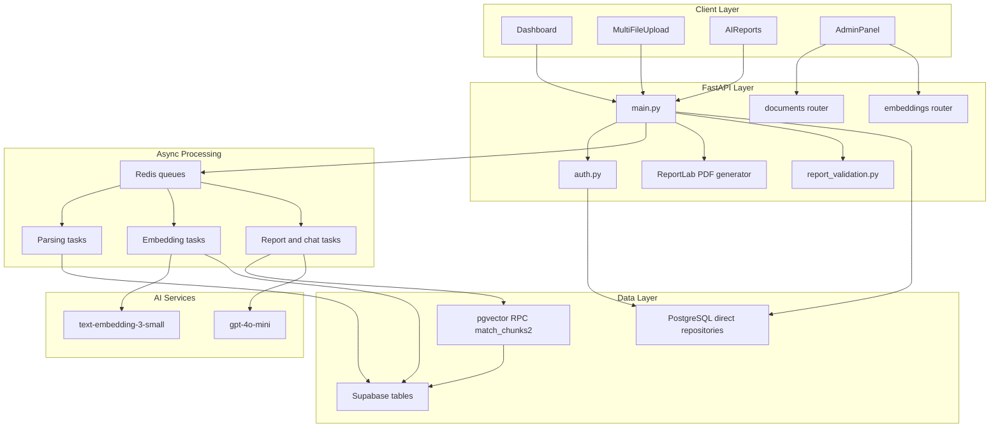
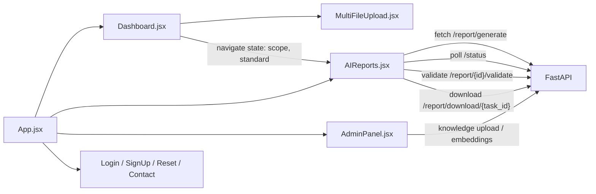
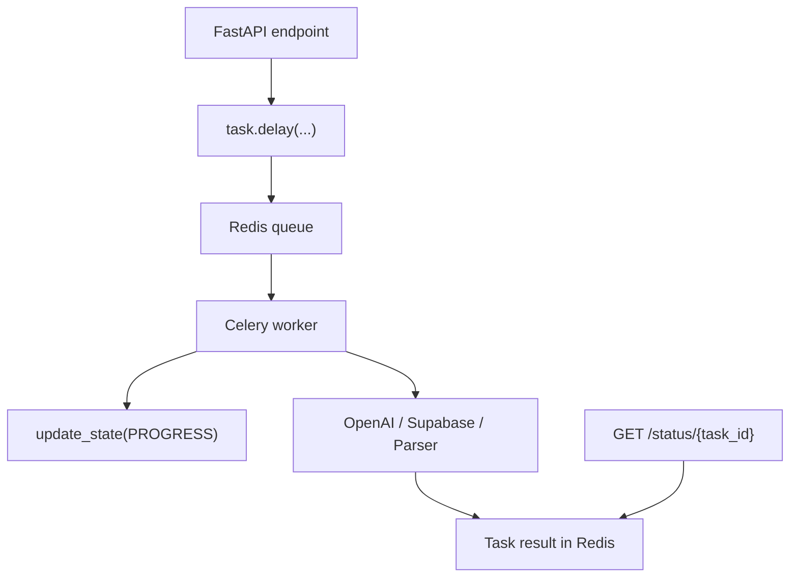
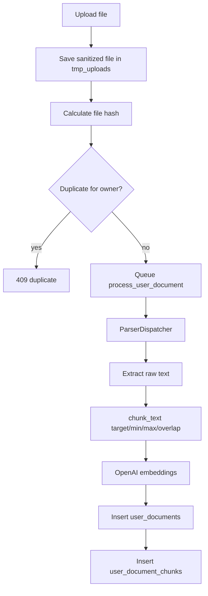
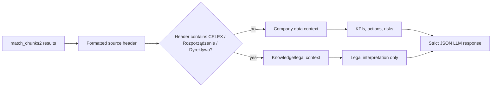
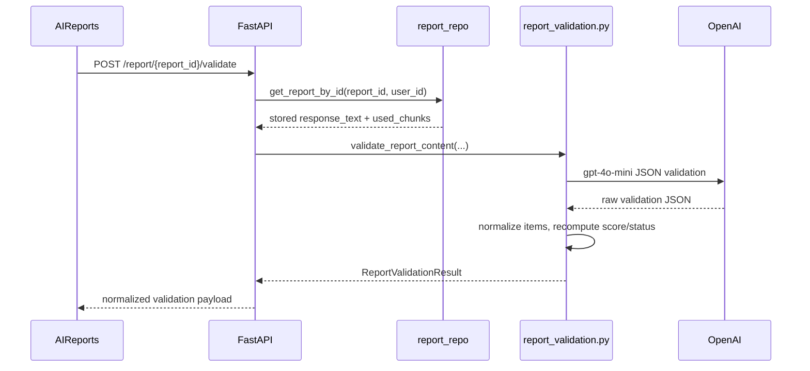
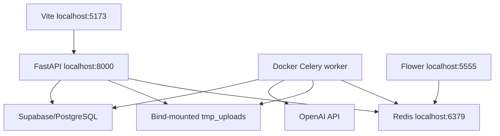

# Architecture Deep Dive

Status: internal technical documentation  
Project: `JKPSZ3-platforma-etg`  
Last updated: 2026-05-23  
Primary audience: senior developers, architects, DevOps, platform owners

## 1. Executive Summary

The platform uses a modular monolith backend with asynchronous workers. FastAPI
accepts user requests and delegates long-running workloads to Celery. Redis is
both broker and result backend. Supabase/PostgreSQL stores documents, chunks,
chat sessions and knowledge-base data; a direct PostgreSQL connection is used
for users and report history. OpenAI provides embeddings and LLM completions.

The main architectural concern is strict source separation: company documents
are the only valid source for company KPIs, while knowledge-base/legal documents
can only provide regulatory interpretation. This rule is encoded in the report
prompt and reinforced by RAG source splitting in `backend/celery/report_tasks.py`.

## 2. Logical Architecture



## 3. Backend Architecture

### 3.1 FastAPI Application

`backend/main.py` is the application composition root. It configures CORS,
connects routers, exposes synchronous API endpoints and registers task ownership
metadata in Redis for selected background jobs.

Important responsibilities:

- Auth-protected file upload endpoints.
- Task enqueueing and `/status/{task_id}` normalization.
- Report generation entrypoint and PDF download.
- Manual report validation entrypoints.
- Knowledge-base ingestion entrypoints.
- Chat session and chat task endpoints.
- Basic ingestion diagnostics for URL/file chunking.

### 3.2 Authentication

`backend/auth.py` implements:

- OAuth2 password login at `/auth/login`.
- Optional signup at `/auth/signup`, disabled by default.
- JWT creation with `sub`, `user_id` and `role`.
- `get_current_user` dependency that resolves the user from PostgreSQL.
- bcrypt password hashing.

The application fails at import time if `JWT_SECRET` is missing or shorter than
32 characters. This is correct for secure runtime behavior and must be reflected
in deployment health checks.

### 3.3 Data Access Pattern

The backend currently uses two data access paths:

| Data area | Access method | Files |
|---|---|---|
| Users | Direct PostgreSQL via `psycopg2` | `database/user_repo.py`, `database/db_config.py` |
| Reports | Direct PostgreSQL via `psycopg2` | `database/report_repo.py` |
| Documents/chunks | Supabase client | `database/user_documents_service.py`, `database/knowledge_service.py` |
| Chat | Supabase client | `database/chat_repository.py` |
| Vector search | Supabase RPC | `backend/RAG/rag_retriever.py` |

This mixed approach is functional but increases operational complexity. New
development should either preserve clear ownership boundaries or consolidate
data access behind one repository layer.

## 4. Frontend Architecture



Frontend state is primarily local React state. JWT is stored in `localStorage`;
the role is decoded from the JWT payload client-side for routing UX. Server-side
authorization remains mandatory and must not rely on the client role guard.

Key UI contracts:

- `VITE_API_URL` controls backend URL; fallback is `http://localhost:8000`.
- `VITE_REPORT_MODEL_LABEL` controls the model badge; fallback is `AI POWERED`.
- Report generation passes both `report_scope` and `standard`.
- Report validation preselects the generation standard but runs only on user click.
- Saved report preview loads by `GET /reports/{report_id}`; PDF export in the
  frontend is only available for freshly generated task results.

## 5. Asynchronous Processing Architecture



Celery configuration lives in `backend/celery/celery_app.py`.

| Queue | Routed tasks | Purpose |
|---|---|---|
| `default` | fallback | General background tasks |
| `parsing` | `parse_and_store`, `process_user_document`, knowledge processing, chunk diagnostics | File parsing, chunking and ingestion |
| `embeddings` | document/tag embedding jobs | Targeted vector generation |
| `embeddings_bulk` | all missing embeddings | Bulk reindexing |
| `llm` | `backend.generate_report` | LLM report generation |

Celery reliability settings:

- JSON task/result serialization.
- `task_track_started=True`.
- `result_expires=86400`.
- `task_acks_late=True`.
- `task_reject_on_worker_lost=True`.
- `worker_prefetch_multiplier=1`.
- Global soft/hard time limits with task-level overrides.
- Retry with exponential backoff for OpenAI/network transient errors.

## 6. Data Flow Deep Dive

### 6.1 Document Upload to Vector Store



Supported parser families:

- PDF: `backend/parsers/pdf_parser.py`
- DOCX: `backend/parsers/docx_parser.py`
- XLSX/CSV: `backend/parsers/tabular_parser.py`

The current RAG path primarily uses extracted text. For DOCX inputs, important
test values should also appear in paragraphs, not only in tables.

### 6.2 Report Generation Source Separation



The split is header-based because the RPC currently returns formatted strings.
Future RPC versions should return structured source metadata so the split does
not depend on source-name heuristics.

## 7. API Communication Pattern

The frontend never waits synchronously for long-running processing. The pattern
is consistent:

1. Submit request.
2. Receive `task_id`.
3. Poll `/status/{task_id}`.
4. Render progress, result, error or retry state.

Example request:

```http
POST /user/documents/upload HTTP/1.1
Authorization: Bearer <token>
Content-Type: multipart/form-data

file=@report.docx
tag=environmental
```

Example status result:

```json
{
  "task_id": "user-doc-1",
  "state": "PROGRESS",
  "progress": 70,
  "stage": "chunking_and_embedding",
  "stage_pl": "Generowanie embeddingów",
  "filename": "report.docx",
  "attempts": 1,
  "result": null,
  "error": null
}
```

## 8. Report Validation Architecture

`backend/report_validation.py` owns three static checklists:

- GRI: selected GRI 305 and GRI 401 disclosures.
- SASB: Engineering & Construction Services metrics.
- TCFD: 11 recommended disclosures across governance, strategy, risk management, metrics and targets.

Validation flow:



The LLM decides item-level presence, evidence and recommendations. The backend
then normalizes missing checklist items and recomputes score. This prevents
summary percentages from drifting away from the green/red checklist.

## 9. Error and Resilience Architecture

| Layer | Failure | Handling |
|---|---|---|
| Upload | Oversized file | 50 MB limit, `413` or per-item error |
| Upload | Duplicate hash | `409` or per-item error |
| Parser | Unsupported file | `ValueError` from dispatcher |
| Celery | OpenAI rate/network errors | Auto-retry with backoff |
| Celery | Invalid LLM JSON | Non-retryable `ValueError` |
| RAG | Empty retrieval | `partial_success` for reports |
| Auth | Missing/invalid JWT | `401` |
| Authorization | Foreign task | `403` if Redis owner metadata exists |
| Database | Report write failure | Report task logs warning and still returns generated data |

The system trades strict report persistence for availability during report
generation: if the report JSON is generated but persistence fails, the Celery
result can still be consumed and exported through task-based PDF download.

## 10. Deployment Architecture

Local reference topology:



Production expectations:

- Run API and worker as independently scalable services.
- Use managed Redis or equivalent broker/result backend.
- Replace local temporary shared volume with durable object storage.
- Use platform secrets for OpenAI, Supabase, PostgreSQL and JWT configuration.
- Expose frontend as a static build behind HTTPS.
- Restrict CORS to production frontend origins.
- Protect admin and monitoring surfaces with network and identity controls.

## 11. Monitoring and Logging Architecture

Current signals:

- `/ping` for basic API health.
- `/openai-status` for OpenAI key initialization status.
- `/status/{task_id}` for task lifecycle and progress.
- Flower for worker/task visibility.
- Worker logs for retry/failure root cause.
- `logs.log` for selected backend logging, including RAG source split debug.

Recommended enterprise signals:

- Structured JSON logs with correlation IDs.
- Per-endpoint latency and error-rate metrics.
- Celery task metrics by task name, queue, state and retry count.
- Redis queue depth and result backend memory.
- OpenAI request latency, rate-limit events and token/cost metrics.
- Supabase/PostgreSQL query latency and connection failures.
- Audit log for login, uploads, deletes, report generation and validation.

## 12. Security Architecture

Security boundaries:

- Browser only receives JWT and public frontend configuration.
- Backend holds service credentials and OpenAI keys.
- Celery worker holds the same service credentials as backend for async work.
- Supabase service-role access requires explicit application-layer ownership checks.

Current controls:

- JWT bearer auth.
- bcrypt password hashing.
- Signup disabled by default.
- CORS allowlist.
- SSRF guard for URL ingestion.
- File size limit.
- Duplicate hash checks.
- Owner checks for user documents, reports and task status where metadata exists.

Current hardening backlog:

- Add explicit admin authorization to embedding reindex endpoints.
- Add owner verification to chat history retrieval.
- Add persisted audit trails.
- Add request/body size enforcement at reverse proxy.
- Add malware scanning for uploaded files if exposed to untrusted users.
- Avoid local file logging as the only durable operational log.

## 13. Architectural Decision Notes

| Decision | Current rationale | Risk / follow-up |
|---|---|---|
| Celery for long-running work | Prevents HTTP timeouts and supports progress polling | Needs robust worker scaling and dead-letter strategy |
| Redis as result backend | Simple task status retrieval | Results expire after 24h; persisted report history covers only saved reports |
| Static validation checklists | Deterministic standard coverage and no runtime internet dependency | Requires code release for checklist changes |
| Mixed PostgreSQL/Supabase access | Reuses existing repository and Supabase vector features | Increases consistency and authorization complexity |
| Task-based PDF export | Avoids re-running LLM and exports cached result | Saved reports currently lack equivalent frontend PDF export path |

## 14. Development Impact Map

When changing an endpoint contract, update all of:

- Backend request/response models and task payloads.
- Frontend fetch calls and state handling.
- Tests under `backend/test_*.py`.
- Documentation under `docs/`.
- `AGENTS.md` if the change affects active working notes or current report contract.

This rule is explicitly stated in `AGENTS.md`: code is the source of truth, but
contract changes must keep backend, frontend, tests and documentation aligned.

