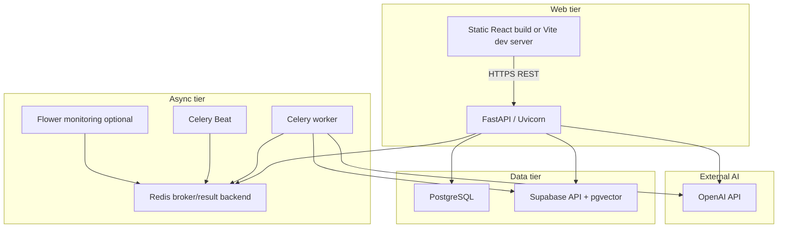
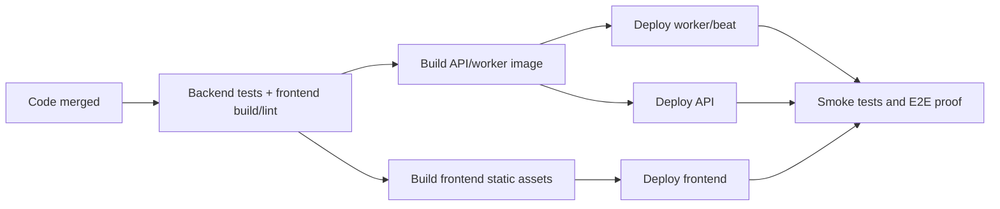
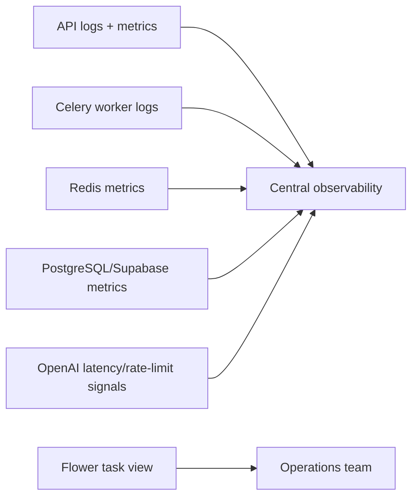

# Deployment Guide

Status: internal technical documentation  
Project: `JKPSZ3-platforma-etg`  
Last updated: 2026-05-23  
Primary audience: DevOps, platform engineers, release owners

## 1. Purpose

This guide describes how to deploy, configure and operate the ESG platform. It
covers local reference deployment, production deployment expectations, required
environment variables, dependency topology, health checks, logging, monitoring,
error handling and rollback considerations.

## 2. Runtime Topology



## 3. Deployment Components

| Component | Required | Scaling model | Notes |
|---|---:|---|---|
| Frontend static build | Yes | CDN/static hosting | Built with `npm.cmd run build` |
| FastAPI API | Yes | Horizontal | Stateless except local tmp upload handling |
| Redis | Yes | Managed or containerized | Broker and result backend |
| Celery worker | Yes | Horizontal by queue | Needs same code and secrets as API |
| Celery Beat | Optional now | Single instance | Ready for scheduled tasks |
| Flower | Optional | Internal only | Protect with auth/network policy |
| PostgreSQL/Supabase | Yes | Managed preferred | Includes pgvector RPC |
| Shared file/object storage | Required for distributed production | Durable object store recommended | Replaces local `tmp_uploads` shared volume |

## 4. Local Reference Deployment

The current repository is configured for a Windows + PowerShell developer host
where FastAPI runs on the host and async services run in Docker.

```powershell
docker compose up -d redis celery-worker celery-beat
docker compose --profile monitoring up -d flower
```

Start API:

```powershell
.\.venv\Scripts\Activate.ps1
$env:PYTHONPATH="."
python -m uvicorn backend.main:app --reload --host 0.0.0.0 --port 8000
```

Start frontend:

```powershell
cd frontend
npm.cmd run dev
```

Local endpoints:

| Service | URL |
|---|---|
| Frontend | `http://localhost:5173` |
| API | `http://localhost:8000` |
| OpenAPI | `http://localhost:8000/docs` |
| Redis | `localhost:6379` |
| Flower | `http://localhost:5555` |

## 5. Environment Configuration

### 5.1 Backend and Worker

```powershell
OPENAI_API_KEY=sk-...
SUPABASE_URL=https://<project>.supabase.co
SUPABASE_SERVICE_ROLE_KEY=<service-role-key>
DB_HOST=<host>
DB_NAME=<db>
DB_USER=<user>
DB_PASSWORD=<password>
DB_PORT=5432
REDIS_URL=redis://localhost:6379/0
CELERY_RESULT_BACKEND=redis://localhost:6379/0
CELERY_TIMEZONE=Europe/Warsaw
JWT_SECRET=<min-32-chars>
JWT_ALGORITHM=HS256
ACCESS_TOKEN_EXPIRE_MINUTES=60
SIGNUP_ENABLED=false
ALLOWED_ORIGINS=https://<frontend-domain>
UPLOAD_TMP_ROOT=<shared-upload-path>
WORKER_TMP_ROOT=<worker-mounted-upload-path>
```

### 5.2 Frontend

```powershell
VITE_API_URL=https://<api-domain>
VITE_REPORT_MODEL_LABEL=AI POWERED
```

### 5.3 PDF Rendering

```powershell
ESG_PDF_LOGO_PATH=/app/assets/logo.png
ESG_PDF_FONT_REGULAR=/usr/share/fonts/truetype/dejavu/DejaVuSans.ttf
ESG_PDF_FONT_BOLD=/usr/share/fonts/truetype/dejavu/DejaVuSans-Bold.ttf
```

The Celery Dockerfile installs `fonts-dejavu-core`. On Windows, ReportLab tries
Arial fonts first.

## 6. Build and Release Process



Recommended pre-release commands:

```powershell
.\.venv\Scripts\python.exe -m pytest backend\test_report_tasks.py backend\test_common_endpoints.py backend\test_negative_integration.py
.\.venv\Scripts\python.exe -m pytest backend\test_pdf_generator.py
cd frontend
npm.cmd run build
npm.cmd run lint
```

Live smoke test with dependencies:

```powershell
.\.venv\Scripts\python.exe backend\test_e2e.py Environmental
```

## 7. Production Deployment Recommendations

### 7.1 API

- Run Uvicorn behind a reverse proxy or platform ingress.
- Terminate TLS at ingress.
- Set `ALLOWED_ORIGINS` to exact frontend origins.
- Configure request size limit at ingress to align with the 50 MB application limit.
- Export stdout/stderr to centralized logs.
- Scale horizontally if report generation is fully moved to Celery and local tmp storage is replaced with object storage.

### 7.2 Worker

- Run at least one worker subscribed to all queues:

```text
default,parsing,embeddings,embeddings_bulk,llm
```

- For production, consider separate worker pools per queue:

| Pool | Queue | Suggested scaling driver |
|---|---|---|
| Parsing | `parsing` | upload volume and file size |
| Embeddings | `embeddings` | number of documents to reindex |
| Bulk embeddings | `embeddings_bulk` | scheduled maintenance windows |
| LLM | `llm` | report/chat request volume and OpenAI latency |

### 7.3 Redis

- Use a managed Redis service for production.
- Enable TLS when supported; `rediss://` is handled in `celery_app.py`.
- Monitor memory because task results remain for 24 hours by default.
- Use a separate logical database or Redis instance for production vs staging.

### 7.4 File Storage

The local implementation writes uploads to `tmp_uploads` and passes relative
paths to workers. This is suitable for local Docker bind mounts.

Production options:

| Option | Recommendation |
|---|---|
| Shared POSIX volume | Acceptable for single-region controlled deployments |
| Object storage | Preferred for scalable production |
| Local disk per container | Not acceptable unless API and worker are colocated and sticky |

If object storage is introduced, API should upload files to a bucket and pass
object keys to Celery. Workers should download, process and delete temporary
local copies.

## 8. Database Deployment

Required logical tables:

- `app_users`
- `user_documents`
- `user_document_chunks`
- `knowledge_documents`
- `knowledge_chunks`
- `reports`
- `chat_sessions`
- `chat_messages`

Required vector capability:

- pgvector-compatible `embedding` columns.
- Supabase RPC `match_chunks2`.

The application expects `match_chunks2` to accept:

- `query_embedding`
- `match_threshold`
- `match_count`
- `filter_tag`
- `query_user_id`

and return rows containing at least:

- `source`
- `chunk_text`
- `similarity`

## 9. Health Checks and Smoke Tests

| Check | Command / endpoint | Expected |
|---|---|---|
| API liveness | `GET /ping` | `{"message":"pong"}` |
| OpenAI config | `GET /openai-status` | `status: ok` when key is valid |
| Redis | `redis-cli ping` | `PONG` |
| Worker online | Flower worker page | Worker status `Online` |
| Report pipeline | `backend/test_e2e.py` | Task reaches `SUCCESS` |
| Frontend build | `npm.cmd run build` | Vite build succeeds |

## 10. Monitoring



Minimum production alerts:

- API 5xx rate above threshold.
- Auth failures spike.
- Celery queue backlog grows for more than defined SLA.
- Celery task failure/retry rate exceeds baseline.
- Redis memory near limit.
- OpenAI rate limit or timeout errors increase.
- Supabase/PostgreSQL connection errors.
- Disk/object-storage failures for upload processing.

## 11. Logging

Current implementation:

- Uvicorn logs to stdout/stderr.
- `backend/main.py` configures `logs.log` with `filemode='w+'`.
- Celery logs to worker stdout.
- RAG report/chat source split diagnostics use Python logging.

Production recommendation:

- Use centralized structured logs.
- Include `user_id`, `task_id`, endpoint, queue, report scope and standard where appropriate.
- Do not log secrets, raw JWTs, OpenAI keys or full uploaded document content.
- Treat RAG chunks as potentially sensitive; only log source names and counts in production.

## 12. Security Deployment Controls

| Control | Required action |
|---|---|
| TLS | Enforce HTTPS for frontend and API |
| Secrets | Store in platform secret manager |
| CORS | Set exact production origins only |
| JWT | Use unique 32+ char secret per environment |
| Supabase key | Keep service-role key only in backend/worker |
| Admin routes | Enforce backend role checks |
| Flower | Internal network or authenticated proxy only |
| Uploads | Ingress body limit, application 50 MB limit, optional malware scanning |
| URL ingestion | Preserve SSRF guard and restrict outbound network if possible |

## 13. API Request Examples for Smoke Testing

Login:

```bash
curl -X POST "https://api.example.com/auth/login" \
  -H "Content-Type: application/x-www-form-urlencoded" \
  -d "username=admin&password=admin"
```

Generate report:

```bash
curl -X POST "https://api.example.com/report/generate" \
  -H "Authorization: Bearer $TOKEN" \
  -H "Content-Type: application/json" \
  -d '{"report_scope":"ESG","standard":"GRI"}'
```

Validate report:

```bash
curl -X POST "https://api.example.com/report/42/validate" \
  -H "Authorization: Bearer $TOKEN" \
  -H "Content-Type: application/json" \
  -d '{"standard":"SASB"}'
```

Download PDF:

```bash
curl -L "https://api.example.com/report/download/$TASK_ID" \
  -H "Authorization: Bearer $TOKEN" \
  -o raport_ESG.pdf
```

## 14. Rollback Strategy

Rollback should account for both code and data contracts.

| Change type | Rollback expectation |
|---|---|
| Frontend-only | Revert static build |
| API contract | Roll back API and frontend together |
| Celery task payload | Roll back API and worker together to avoid payload mismatch |
| Database schema | Use forward-compatible migrations; avoid destructive rollback without backup |
| Report checklist changes | Roll back backend code and documentation together |

Important: if Redis still contains task payloads from a newer deployment, an
older worker may fail to deserialize or execute them. Drain or expire queues
before rolling back incompatible task signatures.

## 15. Disaster Recovery Considerations

- PostgreSQL/Supabase backups must cover users, reports, documents, chunks and chat.
- Redis is not the system of record; task results expire after 24 hours.
- Uploaded temp files are transient. Durable source retention must be implemented
  separately if business requirements require original file archival.
- Report history stores generated JSON and used chunks; this is the main durable
  artifact for generated reports.

## 16. Known Deployment Gaps

| Gap | Impact | Recommendation |
|---|---|---|
| Local tmp shared path design | Not horizontally scalable as-is | Move to object storage |
| Flower lacks built-in auth in compose | Sensitive task metadata exposure | Restrict network or proxy with auth |
| Embedding endpoints do not enforce admin in backend | Non-admin authenticated user could enqueue costly jobs | Add role check |
| Chat history lacks owner check | Cross-session read risk if ID is known | Add owner verification |
| `logs.log` file overwrite behavior | Poor audit durability | Use structured centralized logging |

