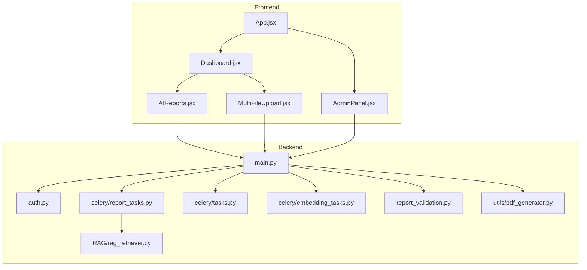
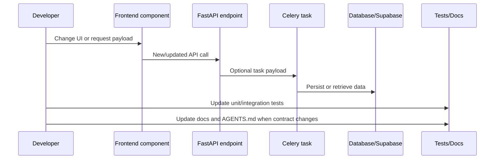

# Developer Guide

Status: internal technical documentation  
Project: `JKPSZ3-platforma-etg`  
Last updated: 2026-05-23  
Primary audience: backend developers, frontend developers, QA engineers

## 1. Purpose

This guide provides the practical development baseline for the ESG platform. It
explains how to run the project locally, how the code is organized, how backend
and frontend communicate, how to test changes, and which contracts must remain
stable during development.

## 2. Repository Structure

```text
JKPSZ3-platforma-etg/
  AGENTS.md
  backend/
    main.py
    auth.py
    report_validation.py
    celery/
    documents_getter_endpoints/
    embeddings/
    ingestion/
    parsers/
    RAG/
    utils/
    test_*.py
  database/
    db_config.py
    supabase_client.py
    report_repo.py
    user_repo.py
    knowledge_service.py
    user_documents_service.py
    chat_repository.py
  frontend/
    package.json
    vite.config.js
    src/
      App.jsx
      components/
      pages/
      styles/
  docs/
  sample_uploads/
  docker-compose.yml
  Dockerfile.celery
```

## 3. Local Prerequisites

| Tool | Version / expectation | Purpose |
|---|---|---|
| Python | 3.11+ for backend runtime; existing repo uses `.venv` | FastAPI, Celery, tests |
| Node.js | 18+; local environment currently has Node available | Vite/React |
| Docker Compose | Required for Redis, Celery worker, Celery Beat and Flower | Async infrastructure |
| PostgreSQL / Supabase | External database service | Auth, reports, documents, vectors |
| OpenAI API key | Access to `gpt-4o-mini` and `text-embedding-3-small` | LLM and embeddings |

Backend dependencies are listed in `backend/requirements.txt`. Frontend
dependencies are listed in `frontend/package.json`.

## 4. Environment Variables

Create `.env` at repository root. Do not commit it.

```powershell
OPENAI_API_KEY=sk-...
SUPABASE_URL=https://<project>.supabase.co
SUPABASE_SERVICE_ROLE_KEY=<service-role-key>

DB_HOST=<postgres-host>
DB_NAME=<database-name>
DB_USER=<database-user>
DB_PASSWORD=<database-password>
DB_PORT=5432

REDIS_URL=redis://localhost:6379/0
CELERY_RESULT_BACKEND=redis://localhost:6379/0
CELERY_TIMEZONE=Europe/Warsaw

JWT_SECRET=<random-secret-min-32-chars>
JWT_ALGORITHM=HS256
ACCESS_TOKEN_EXPIRE_MINUTES=60
SIGNUP_ENABLED=false
ALLOWED_ORIGINS=http://localhost:5173
TZ=Europe/Warsaw
```

Frontend:

```powershell
VITE_API_URL=http://localhost:8000
VITE_REPORT_MODEL_LABEL=AI POWERED
```

Optional PDF:

```powershell
ESG_PDF_LOGO_PATH=C:\path\to\logo.png
ESG_PDF_FONT_REGULAR=C:\Windows\Fonts\arial.ttf
ESG_PDF_FONT_BOLD=C:\Windows\Fonts\arialbd.ttf
```

## 5. Running Locally

### 5.1 Backend API

```powershell
.\.venv\Scripts\Activate.ps1
$env:PYTHONPATH="."
python -m uvicorn backend.main:app --reload --host 0.0.0.0 --port 8000
```

API documentation is available at:

- `http://localhost:8000/docs`
- `http://localhost:8000/openapi.json`

### 5.2 Redis, Celery and Flower

```powershell
docker compose up -d redis celery-worker celery-beat
docker compose --profile monitoring up -d flower
docker compose logs -f celery-worker
```

Flower runs at `http://localhost:5555` when the monitoring profile is enabled.

### 5.3 Frontend

```powershell
cd frontend
npm.cmd install
npm.cmd run dev
```

Use `npm.cmd` on Windows PowerShell. Direct `npm` may be blocked by
ExecutionPolicy because it resolves to `npm.ps1`.

## 6. Component Map for Developers



## 7. Backend Development Workflow

### 7.1 Adding or Changing API Endpoints

1. Add or update Pydantic request models in `backend/main.py` or the relevant router.
2. Use `Depends(get_current_user)` for user-scoped endpoints.
3. Enforce ownership in backend code before reading or deleting user data.
4. Register Celery task ownership with `_register_task_owner` when the endpoint returns a task id.
5. Add tests in `backend/test_common_endpoints.py` or a focused test file.
6. Update `docs/API_REFERENCE_EXTENDED.md` and related architecture documentation.
7. Update frontend fetch calls and states if the response contract changes.

### 7.2 Current Report Contract

```python
class ReportGenerateRequest(BaseModel):
    report_scope: Literal["Environmental", "Social", "Governance", "ESG"]
    standard: Optional[Literal["GRI", "SASB", "TCFD"]] = "GRI"
```

Backend behavior:

- Missing `standard` defaults to `GRI`.
- The selected standard is passed to `generate_report_task`.
- `report_json["standard_raportowania"]` is enforced after LLM JSON parsing.
- The task result returns `standard`, `report_id`, `used_chunks` and `data`.

### 7.3 Celery Task Pattern

Use the existing task pattern:

```python
self.update_state(
    state="PROGRESS",
    meta={
        "step": "parsing",
        "stage_pl": "Parsowanie dokumentu",
        "progress": 20,
        "filename": original_filename,
    },
)
```

The frontend consumes `state`, `progress`, `stage`, `stage_pl`, `filename`,
`result` and `error` from `/status/{task_id}`.

### 7.4 RAG Retrieval Pattern

`retrieve_context_async` expects:

- natural-language query,
- authenticated `user_id`,
- `match_threshold`,
- `match_count`,
- optional `filter_tag`.

The function generates an embedding and calls Supabase RPC `match_chunks2` with
`query_embedding`, `match_threshold`, `match_count`, `filter_tag` and
`query_user_id`.

## 8. Frontend Development Workflow

### 8.1 API Base URL

All primary frontend API calls use:

```javascript
const API_URL = import.meta.env.VITE_API_URL || "http://localhost:8000";
```

Do not introduce hardcoded backend URLs in new components.

### 8.2 Token Handling

`App.jsx` stores the JWT in `localStorage` and decodes the role for UI routing.
This is a UX guard only. Backend endpoints must still validate roles.

### 8.3 Report Generation Integration

`Dashboard.jsx` navigates to `/aireports` with:

```javascript
{
  state: {
    doc: doc || null,
    scope,
    standard
  }
}
```

`AIReports.jsx` sends:

```javascript
body: JSON.stringify({
  report_scope: tag,
  standard: standard || "GRI"
})
```

### 8.4 Upload Integration

`MultiFileUpload.jsx` sends one file per request to
`POST /user/documents/upload` and polls `/status/{task_id}` every 1500 ms.
The component supports:

- maximum 10 files,
- maximum 50 MB each,
- upload concurrency of 3,
- optional ESG tag,
- retry for retryable failures.

## 9. Data Flow for Feature Work



## 10. API Examples for Local Testing

Login:

```powershell
$body = @{
  username = "admin"
  password = "admin"
}
$token = (Invoke-RestMethod -Method Post -Uri http://localhost:8000/auth/login -Body $body).access_token
```

Generate report:

```powershell
Invoke-RestMethod `
  -Method Post `
  -Uri http://localhost:8000/report/generate `
  -Headers @{ Authorization = "Bearer $token" } `
  -ContentType "application/json" `
  -Body '{"report_scope":"Environmental","standard":"GRI"}'
```

Poll status:

```powershell
Invoke-RestMethod `
  -Method Get `
  -Uri http://localhost:8000/status/<task_id> `
  -Headers @{ Authorization = "Bearer $token" }
```

Validate saved report:

```powershell
Invoke-RestMethod `
  -Method Post `
  -Uri http://localhost:8000/report/<report_id>/validate `
  -Headers @{ Authorization = "Bearer $token" } `
  -ContentType "application/json" `
  -Body '{"standard":"TCFD"}'
```

## 11. Tests

Fast local tests from `AGENTS.md`:

```powershell
.\.venv\Scripts\python.exe -m pytest backend\test_report_tasks.py backend\test_common_endpoints.py backend\test_negative_integration.py
```

Additional useful tests:

```powershell
.\.venv\Scripts\python.exe -m pytest backend\test_pdf_generator.py
.\.venv\Scripts\python.exe -m pytest backend\test_rag_quality_sample_docs.py
```

Frontend:

```powershell
cd frontend
npm.cmd run build
npm.cmd run lint
```

Known local sandbox note: `npm.cmd run build` may return `Access is denied`
while loading `vite.config.js` in a sandboxed environment. If that happens,
rerun the same build outside the sandbox.

## 12. Error Scenarios to Test

| Area | Scenario | Expected behavior |
|---|---|---|
| Auth | Missing token | `401` |
| Upload | Same file uploaded twice by same user | `409` |
| Upload | File greater than 50 MB | `413` or per-item upload error |
| Report | Unknown standard | `422` for `/report/generate`, `400` for validation |
| Report | No chunks for partial scope | `partial_success` with `data: null` |
| Status | Foreign task id | `403` when owner metadata mismatches |
| Chat | Empty query | `400` |
| Knowledge | Non-admin upload | `403` |

## 13. Logging and Debugging

Useful debugging entrypoints:

```powershell
docker compose logs -f celery-worker
.\.venv\Scripts\python.exe diagnose_rag.py "emisje CO2" "<user_id>" "Environmental"
```

Common places to inspect:

- `logs.log` for selected backend logging and RAG source split diagnostics.
- Flower task details for state transitions and task result payload.
- `/status/{task_id}` for normalized task metadata.
- Supabase tables for document and chunk persistence.

## 14. Security Notes for Developers

- Never send `SUPABASE_SERVICE_ROLE_KEY` to the frontend.
- Do not trust decoded frontend roles; enforce roles in backend.
- Keep ownership checks close to repository mutations.
- Validate and sanitize filenames through existing helpers.
- Keep SSRF protection in `_assert_url_not_ssrf` when changing URL ingestion.
- Treat LLM output as untrusted; parse and normalize before persisting or rendering.

## 15. Definition of Done for Contract Changes

A change that modifies API behavior is complete only when:

- backend code is updated,
- frontend integration is updated,
- tests are updated,
- `docs/` is updated,
- `AGENTS.md` is updated when the active report contract or local workflow changes,
- local fast backend tests and frontend build/lint have been run or explicitly documented as not run.

## 16. Development Backlog Candidates

| Item | Reason |
|---|---|
| Add admin checks to embedding endpoints | UI treats these as admin actions; backend should enforce the same |
| Add chat history ownership verification | Current code has TODO and reads by session id |
| Add PDF export by `report_id` | Saved report preview currently cannot export from frontend |
| Persist validation results | Enables auditability and validation history |
| Consolidate data access | Reduces mixed Supabase/direct PostgreSQL behavior |
| Add structured logging | Improves production support and incident review |

