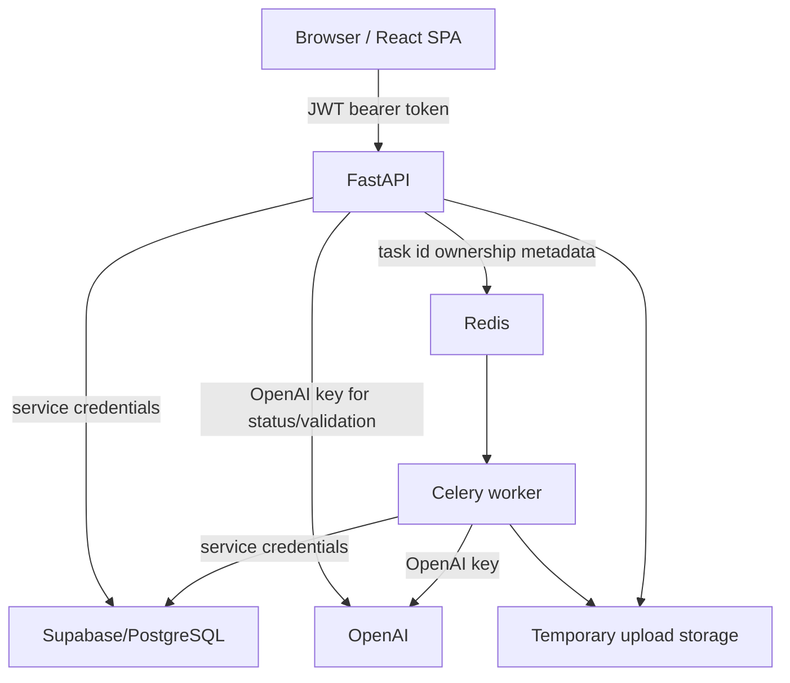
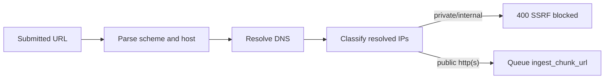
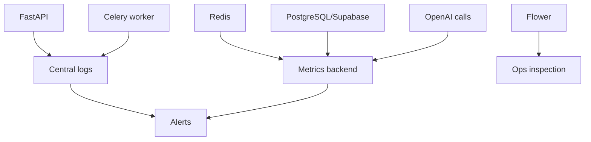

# Security and Monitoring

Status: internal technical documentation  
Project: `JKPSZ3-platforma-etg`  
Last updated: 2026-05-24  
Primary audience: security reviewers, DevOps, SRE, backend owners

## 1. Purpose

This document defines the security baseline and monitoring model for the ESG
platform. It describes trust boundaries, authentication, authorization,
secret handling, file and URL ingestion risks, LLM/RAG risks, operational
logging, alerting and known hardening items.

## 2. Trust Boundaries



Trust boundary rules:

- The browser is untrusted.
- JWT content decoded by the frontend is for UI only.
- Backend must enforce all authorization decisions.
- Supabase service-role key bypasses RLS; backend ownership checks are mandatory.
- Celery workers are trusted backend components and require the same secrets as API.
- Uploaded files and LLM outputs are untrusted inputs.

## 3. Authentication

Authentication is implemented in `backend/auth.py`.

| Feature | Implementation |
|---|---|
| Login endpoint | `POST /auth/login` with `OAuth2PasswordRequestForm` |
| Token type | JWT bearer |
| Token fields | `sub`, `user_id`, `role`, `exp` |
| Password hashing | bcrypt |
| Signup | Disabled unless `SIGNUP_ENABLED=true` |
| JWT secret | Required, minimum 32 characters |

Rate limiting is implemented in `backend/rate_limiting.py` with a fixed-window
counter. Redis is preferred through `RATE_LIMIT_REDIS_URL` or `REDIS_URL`; if
Redis is unavailable the API falls back to in-process memory. Endpoint-specific
limits protect login, signup, contact, uploads/ingest, report generation, chat
and task-status polling. Exceeded limits return `429` with `Retry-After`.

Example:

```http
POST /auth/login HTTP/1.1
Content-Type: application/x-www-form-urlencoded

username=admin&password=admin
```

Response:

```json
{
  "access_token": "<jwt>",
  "token_type": "bearer"
}
```

## 4. Authorization Model

Current backend authorization:

| Resource | Authorization behavior |
|---|---|
| User documents | JWT required; upload/delete use token-derived user id |
| Document delete | Explicit owner check in `delete_user_document_cascade` |
| Document finalization | Deletes all owned source docs/chunks and clears owned report evidence |
| Reports list/get/delete | Token-derived `user_id` passed to repository query |
| Report validation | Stored report fetched by `report_id` and `user_id` |
| Task status/download | Redis owner metadata checked when available |
| Knowledge upload | Requires `role == "admin"` |
| Knowledge list | Requires `role == "admin"` |
| Admin UI | Client route guard plus backend checks on some endpoints |
| Embeddings endpoints | JWT required; current router does not enforce admin role |
| Chat history | JWT required; current code has TODO for session owner verification |

Hardening requirements:

- Add backend admin role checks to `/embeddings/generate-for-document`,
  `/embeddings/generate-for-tag` and `/embeddings/generate-all`.
- Add owner validation to `/chat/sessions/{session_id}/history`.
- Treat missing Redis task owner metadata as legacy compatibility only; new task
  producers should always register owners.

## 5. Secrets and Configuration

Secrets must never be committed or exposed to the frontend.

| Secret | Used by | Notes |
|---|---|---|
| `OPENAI_API_KEY` | API and worker | Required for embeddings, report/chat generation and validation |
| `SUPABASE_SERVICE_ROLE_KEY` | API and worker | Highly privileged; backend-only |
| `DB_PASSWORD` | API | Direct PostgreSQL repositories |
| `JWT_SECRET` | API | 32+ characters; unique per environment |
| Redis credentials/TLS URL | API and worker | Use `rediss://` for TLS-managed Redis |

Operational controls:

- Store secrets in a platform secret manager.
- Rotate secrets per environment.
- Do not print full secrets in diagnostics. `test_real_openai.py` prints partial
  key details and should not be used in shared logs.
- Keep `.env` out of version control.

## 6. File Upload Security

Current controls:

- Maximum size: 50 MB.
- Maximum multi-upload count: 10 files.
- Filename sanitization via `sanitize_filename`.
- Disk validation via `validate_file_on_disk` in selected endpoints.
- Duplicate hash checks for user documents and knowledge-base documents.
- Temporary files are cleaned by Celery task `finally` blocks.
- User-triggered finalization deletes source documents and chunks and clears
  `reports.used_chunks`; generated report JSON remains until report deletion.

Supported parser families:

- PDF
- DOCX
- XLSX/CSV
- TXT/text-like diagnostics depending on endpoint

Production recommendations:

- Add ingress body-size limit equal to or lower than 50 MB.
- Add malware scanning if users are untrusted.
- Store original uploads in durable object storage only when business retention
  requirements are defined.
- Do not log raw uploaded content.
- Add MIME/content validation at the API boundary if file types are expanded.

## 7. URL Ingestion and SSRF

`POST /ingest/chunk/url` uses `_assert_url_not_ssrf` before queueing the task.

Blocked:

- non-HTTP(S) schemes,
- URLs with embedded userinfo,
- unresolved hosts,
- private IPs,
- loopback IPs,
- link-local IPs,
- multicast IPs,
- reserved/unspecified IPs.



Recommended production addition: restrict worker outbound network access where
possible and apply DNS rebinding protection at the infrastructure layer.

## 8. LLM and RAG Security

Risk areas:

| Risk | Current mitigation | Additional recommendation |
|---|---|---|
| LLM hallucinated KPIs | Prompt forbids KPIs outside company documents; backend enforces JSON parse | Add deterministic post-checks for numeric evidence |
| Legal context used as company evidence | Source split separates company vs legal chunks | Use structured source metadata instead of header heuristics |
| Prompt injection from uploaded files | System prompt and strict JSON response format | Add content classification and instruction-stripping guardrails |
| Invalid LLM JSON | Raises non-retryable `ValueError` | Persist failure reason and add retry with repair prompt if needed |
| Validation score drift | Backend recomputes score/status | Persist validation result for audit |

Report generation source policy:

- `wskazniki_liczbowe`, `wdrozone_polityki_i_dzialania` and
  `zidentyfikowane_ryzyka` must come only from company documents.
- Knowledge-base/legal documents may inform only compliance interpretation.
- Missing disclosures must be reported as data gaps, not invented values.

## 9. Monitoring Model



Minimum metrics:

| Signal | Source | Alert trigger |
|---|---|---|
| API 5xx rate | API logs/APM | sustained increase |
| API latency | API/APM | p95 above SLA |
| Auth failures | API logs | spike or brute-force pattern |
| Rate-limit 429 count | API logs/APM | spike by endpoint or IP/user |
| Celery queue depth | Redis/Celery | backlog above threshold |
| Task failure rate | Celery/Flower | failure ratio above baseline |
| Task retry rate | Celery logs | repeated transient failures |
| OpenAI timeout/rate-limit count | worker/API logs | sustained increase |
| Embedding coverage | `/embeddings/status` | coverage below expected threshold |
| Redis memory | Redis metrics | near max memory |
| DB connection failures | API/worker logs | any sustained failure |

## 10. Logging Standards

Current implementation:

- Uvicorn logs request/server events.
- Celery logs task execution to stdout.
- `backend/main.py` configures `logs.log` with `filemode='w+'`.
- RAG source split diagnostics log chunk counts and source names.

Production logging policy:

- Use JSON logs with fields: `timestamp`, `level`, `service`, `request_id`,
  `user_id`, `task_id`, `endpoint`, `queue`, `task_name`, `report_scope`,
  `standard`, `duration_ms`, `error_type`.
- Do not log:
  - JWT tokens,
  - passwords,
  - OpenAI keys,
  - Supabase keys,
  - full document contents,
  - full RAG chunk payloads in production.
- Log source counts and source names instead of full excerpts unless running
  local diagnostics.

## 11. Operational Dashboards

Recommended dashboards:

- API health: request rate, error rate, p95 latency, top failing endpoints.
- Celery: queue depth, active/succeeded/failed/retried tasks by queue.
- Report generation: count by scope/standard, success/partial/failure ratio,
  p95 generation time.
- Ingestion: uploads by file type, parse failures, embedding failures.
- OpenAI: calls, errors, latency, rate limits, estimated cost.
- Database: connection usage, slow queries, RPC failures.
- Security: failed login rate, 403/401 rates, admin action log.

## 12. Incident Playbooks

### 12.1 Celery Tasks Stay Pending

1. Check Redis health.
2. Check worker is online in Flower.
3. Verify worker subscribes to the expected queue.
4. Check worker logs for import errors or missing env vars.
5. Confirm `REDIS_URL` matches between API and worker.

### 12.2 Report Generation Fails

1. Poll `/status/{task_id}` and capture `error.type` and `error.message`.
2. Check worker logs around `backend.generate_report`.
3. Validate OpenAI key and model access.
4. Run `diagnose_rag.py` for the same user/scope.
5. Verify Supabase RPC `match_chunks2` returns rows.
6. Confirm generated JSON parse did not fail.

### 12.3 PDF Export Fails

1. Confirm task state is `SUCCESS`.
2. Confirm the task result still exists in Redis; results expire after 24h.
3. Check `data` payload shape against `ReportData`.
4. Check ReportLab font warnings for Polish characters.
5. Confirm task owner metadata allows current user access.

### 12.4 Knowledge Upload Fails

1. Confirm user has `role == "admin"`.
2. Check duplicate hash conflict.
3. Check parser support for uploaded extension.
4. Check worker logs and OpenAI embedding errors.
5. Check Supabase insert permissions and table schema.

## 13. API Examples for Security Checks

Unauthorized request:

```bash
curl -i https://api.example.com/documents/mine
```

Expected: `401`.

Foreign task ownership check:

```bash
curl -i https://api.example.com/status/<foreign-task-id> \
  -H "Authorization: Bearer $TOKEN"
```

Expected: `403` when owner metadata exists and mismatches.

SSRF blocked URL:

```bash
curl -X POST https://api.example.com/ingest/chunk/url \
  -H "Authorization: Bearer $TOKEN" \
  -H "Content-Type: application/json" \
  -d '{"url":"http://127.0.0.1:8000"}'
```

Expected: `400`.

## 14. Auditability

Current durable audit evidence:

- `reports` table stores generated report JSON and `used_chunks`.
- `chat_messages` stores assistant response metadata for RAG usage.
- Database rows include ownership and created timestamps.
- Celery result backend temporarily stores task results for 24 hours.

Recommended additions:

- Dedicated immutable `audit_events` table.
- Persisted validation results.
- Admin activity log for knowledge-base upload/reindex.
- Report version history.
- User document delete event log.

## 15. Known Risks and Hardening Backlog

| Priority | Item | Risk | Recommended fix |
|---|---|---|---|
| High | Chat history owner verification | Session id guessing could expose history | Verify session belongs to current user before reading messages |
| High | Embedding endpoint role enforcement | Authenticated non-admin could enqueue expensive jobs | Add `role == "admin"` checks |
| Medium | Header-based source split | Misnamed sources can be routed incorrectly | Extend RPC to return structured source type |
| Medium | In-memory rate-limit fallback | Counters are per-process and reset on restart | Use Redis in shared production environments |
| Medium | Local `logs.log` | Non-durable and overwritten | Centralized structured logging |
| Medium | Task result TTL | PDF export by task unavailable after expiry | Add PDF export by stored report id |
| Medium | Service-role Supabase usage | RLS bypass makes code checks critical | Centralize authorization wrappers |
| Low | Frontend localStorage JWT | XSS would expose token | Harden CSP and consider httpOnly cookies for production |

## 16. Security Definition of Done

A production-impacting change is security-ready when:

- authentication and authorization paths are covered by tests,
- ownership checks are explicit for user-scoped data,
- secrets are not logged or exposed to frontend,
- upload/URL inputs are validated,
- LLM output is parsed/normalized before use,
- docs and runbooks are updated,
- monitoring signals exist for the new flow.
