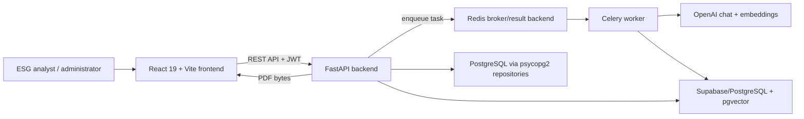
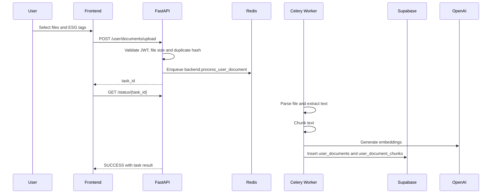
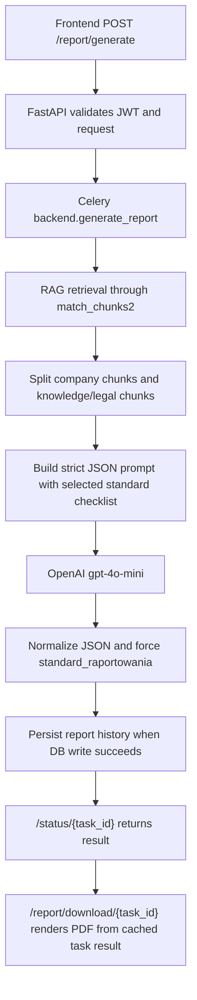
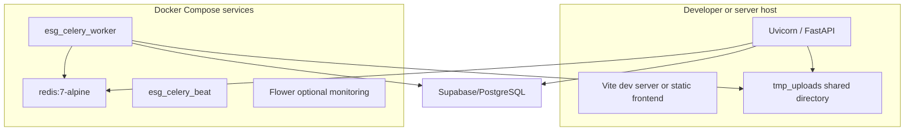

# System Overview

Status: internal technical documentation  
Project: `JKPSZ3-platforma-etg`  
Last updated: 2026-05-23  
Primary audience: backend, frontend, DevOps, QA, security reviewers

## 1. Purpose

`JKPSZ3-platforma-etg` is an ESG reporting platform for construction-sector
organizations. The system ingests company documents, extracts text, chunks and
embeds the content, retrieves ESG-relevant context through RAG, generates
structured ESG reports with an LLM, validates reports against selected
standards, and exports generated reports to PDF.

The operational goal is to reduce manual effort in ESG reporting while keeping
company KPIs separated from legal or knowledge-base reference material. The
current implementation supports GRI, SASB and TCFD checklists through static
backend definitions.

## 2. System Context



The frontend is responsible for authentication UX, uploads, polling task status,
report preview, validation actions and PDF download. FastAPI owns API contracts,
authorization, temporary file handling and task orchestration. Celery owns
long-running parsing, embedding, RAG, report and chat workloads.

## 3. Component Inventory

| Layer | Component | Primary files | Responsibility |
|---|---|---|---|
| Frontend | Application shell and routing | `frontend/src/App.jsx` | Route selection, token storage, admin route guard |
| Frontend | Dashboard | `frontend/src/pages/Dashboard.jsx` | Document history, report history, report scope/standard selection |
| Frontend | Report workspace | `frontend/src/pages/AIReports.jsx` | Starts report tasks, polls status, previews saved reports, validates reports, downloads PDFs |
| Frontend | Multi-file upload | `frontend/src/components/MultiFileUpload.jsx` | Drag-and-drop upload queue, tag selection, polling per file |
| Frontend | Admin panel | `frontend/src/pages/AdminPanel.jsx` | Knowledge-base upload, embedding status, reindex actions |
| Backend | API entrypoint | `backend/main.py` | FastAPI app, CORS, upload endpoints, reports, chat, task status |
| Backend | Authentication | `backend/auth.py` | JWT login/signup/contact, password hashing, current user dependency |
| Backend | Report generation task | `backend/celery/report_tasks.py` | RAG retrieval, prompt construction, OpenAI call, report persistence |
| Backend | Report validation | `backend/report_validation.py` | Static GRI/SASB/TCFD checklists and LLM validation normalization |
| Backend | Document tasks | `backend/celery/tasks.py` | Parse, chunk, embed, knowledge-base processing, chat processing |
| Backend | Embedding tasks | `backend/celery/embedding_tasks.py` | Document/tag/bulk embedding jobs |
| Backend | RAG retriever | `backend/RAG/rag_retriever.py` | Embedding query generation and Supabase RPC `match_chunks2` calls |
| Backend | Parsers | `backend/parsers/*` | PDF, DOCX and tabular parsing behind `ParserDispatcher` |
| Data | PostgreSQL repository access | `database/db_config.py`, `database/report_repo.py`, `database/user_repo.py` | Auth/report access through `psycopg2` |
| Data | Supabase access | `database/supabase_client.py`, `database/knowledge_service.py`, `database/user_documents_service.py` | Document, chunk, knowledge-base and chat access |
| Infrastructure | Redis/Celery/Flower | `docker-compose.yml`, `Dockerfile.celery` | Local async execution and task monitoring |

## 4. Primary User Flows

### 4.1 User Document Ingestion



### 4.2 Report Generation



### 4.3 Manual Report Validation

Report validation is intentionally a separate user-triggered step.
`POST /report/{report_id}/validate` retrieves the stored report owned by the
authenticated user, calls the LLM once with the selected checklist, and
normalizes the score server-side. The backend recomputes `score` and
`overall_status` from checklist items instead of trusting model-provided
percentages.

## 5. Business Logic Summary

The report contract is defined by `AGENTS.md` and current code:

- `POST /report/generate` creates a background Celery task.
- Request body: `{"report_scope": "Environmental" | "Social" | "Governance" | "ESG", "standard": "GRI" | "SASB" | "TCFD"}`.
- `standard` is optional for backward compatibility and defaults to `GRI`.
- `/status/{task_id}` returns `standard`, `report_id`, `used_chunks` and `data` inside the task result.
- `data.standard_raportowania` is enforced by backend after the LLM response.
- GRI/SASB/TCFD checklists are static definitions in `backend/report_validation.py`.
- Runtime report generation and validation do not download checklists from the internet or from the knowledge base.
- Validation remains manual; the frontend preselects the generation standard but does not auto-run validation.

## 6. API Integration Snapshot

All user-scoped endpoints use `Authorization: Bearer <JWT>` unless documented
otherwise.

```http
POST /auth/login HTTP/1.1
Content-Type: application/x-www-form-urlencoded

username=admin&password=admin
```

```http
POST /report/generate HTTP/1.1
Authorization: Bearer <token>
Content-Type: application/json

{
  "report_scope": "ESG",
  "standard": "TCFD"
}
```

```json
{
  "task_id": "celery-task-id",
  "status": "queued",
  "message": "Raport jest generowany w tle. Sprawdz /status/{task_id} po wynik."
}
```

```http
GET /status/celery-task-id HTTP/1.1
Authorization: Bearer <token>
```

```json
{
  "task_id": "celery-task-id",
  "state": "SUCCESS",
  "progress": 100,
  "stage_pl": "Gotowe",
  "result": {
    "status": "success",
    "kategoria": "ESG",
    "standard": "TCFD",
    "report_id": "42",
    "used_chunks": ["--- DOKUMENT: report.docx ---\n..."],
    "data": {
      "kategoria": "ESG",
      "standard_raportowania": "TCFD"
    }
  }
}
```

## 7. Dependencies

| Runtime | Dependency | Notes |
|---|---|---|
| Python | FastAPI, Uvicorn | API server |
| Python | Celery, Redis | Async queue and task result backend |
| Python | OpenAI SDK | Chat completions and embeddings |
| Python | Supabase SDK, psycopg2 | Mixed data access layer |
| Python | pdfplumber, PyPDF2, python-docx, openpyxl, pandas | File parsing |
| Python | ReportLab | Application report PDF generation |
| Frontend | React 19, React DOM, React Router DOM | SPA |
| Frontend | Vite 7, ESLint 9 | Build and lint |
| Infrastructure | Redis 7, Flower 2.0 | Local queue state and monitoring |
| Data | PostgreSQL, pgvector, Supabase | User, report, document and vector data |

## 8. Deployment View



The local reference deployment keeps FastAPI on the host and runs Redis,
Celery worker, Celery Beat and Flower in Docker. The worker reads uploaded
temporary files through a shared `tmp_uploads` volume. In a production
deployment, FastAPI and Celery should share equivalent object storage or a
durable shared volume.

## 9. Logging and Monitoring

| Area | Current implementation | Operational expectation |
|---|---|---|
| API logs | Uvicorn stdout plus `logs.log` configured in `backend/main.py` | Collect stdout/stderr centrally; avoid relying only on local file |
| Task state | Celery state in Redis, visible through `/status/{task_id}` | Monitor queue depth, task latency, failures and retries |
| Worker monitoring | Flower profile in `docker-compose.yml` | Protect Flower in non-local environments |
| RAG diagnostics | `diagnose_rag.py` | Use during retrieval quality incidents |
| E2E validation | `backend/test_e2e.py` | Run only with live API, Redis, OpenAI and database |

## 10. Error Handling Model

| Scenario | Current behavior |
|---|---|
| Missing/invalid JWT | `401` with FastAPI auth error |
| User accesses another user's task | `403` when Redis owner metadata exists and mismatches |
| Duplicate uploaded document | `409` for user uploads or knowledge-base parse-and-store; per-file error item for multi-upload |
| File exceeds 50 MB | `413` or per-file error payload depending on endpoint |
| Celery task transient failure | Auto-retry for selected OpenAI/network exceptions |
| LLM returns invalid report JSON | Task fails with non-retryable `ValueError` |
| No RAG chunks for partial scope | `partial_success`, `data: null`, empty-state PDF supported |
| Missing report during validation | `404` when report does not exist or is not owned by user |

## 11. Security Baseline

- JWT secret is mandatory and must be at least 32 characters.
- Signup is disabled unless `SIGNUP_ENABLED=true`.
- Secrets must live in `.env` or platform secret storage and must not be committed.
- The backend uses Supabase service-role access; ownership checks in backend code are mandatory because service-role keys bypass row-level security.
- URL ingestion includes SSRF protection for private, loopback, link-local, multicast, reserved and unspecified IPs.
- CORS origins are restricted to local Vite origins plus `ALLOWED_ORIGINS` from environment.

Known hardening items:

- Enforce admin role in `/embeddings/*` endpoints if these remain admin-only operational actions.
- Add ownership verification to `/chat/sessions/{session_id}/history`; code currently contains a TODO and reads messages by session id.
- Protect Flower with authentication or network isolation outside local development.
- Avoid exposing `SUPABASE_SERVICE_ROLE_KEY` to frontend or logs.

## 12. Project Structure

```text
JKPSZ3-platforma-etg/
  backend/
    celery/
    embeddings/
    ingestion/
    parsers/
    RAG/
    utils/
    main.py
    auth.py
    report_validation.py
  database/
    *_repo.py
    *_service.py
    supabase_client.py
  frontend/
    src/
      components/
      pages/
  docs/
  sample_uploads/
  docker-compose.yml
  Dockerfile.celery
  Procfile
  Procfile.honcho
```

## 13. Development and Operations Readiness

Minimum local verification:

```powershell
.\.venv\Scripts\python.exe -m pytest backend\test_report_tasks.py backend\test_common_endpoints.py backend\test_negative_integration.py
cd frontend
npm.cmd run build
npm.cmd run lint
```

Operational proof with live dependencies:

```powershell
docker compose up -d redis celery-worker celery-beat
docker compose --profile monitoring up -d flower
.\.venv\Scripts\python.exe -m uvicorn backend.main:app --reload --host 0.0.0.0 --port 8000
.\.venv\Scripts\python.exe backend\test_e2e.py Environmental
```

## 14. Evolution Scenarios

| Scenario | Required changes |
|---|---|
| Production object storage | Replace shared `tmp_uploads` with S3/Azure Blob/GCS and pass object references to Celery |
| Multi-tenant enterprise deployment | Enforce organization-level ownership, tenant isolation and audit logs |
| Report editing workflow | Add report draft model, version history and PDF export by `report_id` |
| Automated regulatory updates | Add admin-controlled ingestion pipeline, source metadata, approvals and checksum/version governance |
| Observability upgrade | Add structured logs, OpenTelemetry traces, Prometheus metrics and alerting |
| Stronger validation | Persist validation results, expose validation history and support rule-based prechecks before LLM validation |

